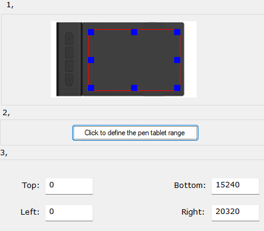

<!DOCTYPE html>
<html>
    <head>
         <meta charset="UTF-8">
    <meta name="viewport" content="width=device-width, initial-scale=1.0">
    <meta name="description" content="Tống Xuân Định - Top 1 Osu!standard của Thành Phố Nam Định">
    <meta name="keywords" content="Tống Xuân Định, Top 1 Nam Định, osu! Nam Định">
    <meta name="author" content="Tống Xuân Định">
    <title>Tong Xuan Dinh</title>
    
    </head>
    <body>
        

            

                <ul>
                <li>Global Ranking</li>
                <li>Country Ranking</li>
                <li>Top 1% Rating</li>
                </ul>
            

            

                <li> </li>
                <li>Tong Xuan Dinh</li>
                <li>Performance Point</li>
                <li>Settings</li>
                <li>Top Mappers</li>
                <li>Rank peaking</li>
                <li>Osu! to Valorant</li>
            </ul>
            

            

                <ul>
                <li>World Settings</li>
                <li>Shopping</li>
                <li>Sign in</li>
                </ul>
            

        

        

            
        

    

        

          
        

        

            
Điểm Được Xếp Hạng : 5.425.728.315

            
Độ Chính Xác : 97,30%

            
Số lần chơi : 36.933

            
Tổng điểm : 34.233.516.246

            
Tổng Lần Bấm : 6.528.884

            
Combo Cao Nhất : 1.602

        

        

            

                <h3>GLOBAL</h3>
                <h1>1,578</h1>
            

            

                <h3>COUNTRY</h3>
                <h1>273</h1>
            

            

                <h3>CITY</h3>
                <h1>1</h1>
            

        

        

            
 RpMDinhVNa9 -<a style="font-size:50px;color:rgb(0, 255, 13)"> SSS </a>- Tống Xuân Định

        

    

    
    

        <h1>VIETNAM's TEAM</h1>
        <h1 style="margin-bottom:40px;"><====DISTincTed====></h1>
        

            
PhucTraNX6

            
SieuPhanDong

            
RpMDinhVNa9

            
TreEmLaSo1

        

    

    

        <h1 style=" margin:60px;text-shadow: 
                -1px -1px 0 #ffffff, 
                1px -1px 0 #ffffff,  
                -1px 1px 0 #ffffff,  
                1px 1px 0 #ffffff;font-size:60px; ">ROLES and WINNING TEAM</h1>
    <table class="mid_header">
    <tr>
        <td>
            
            Corsace Openning Cup 2nd Place Winning Team
        </td>
    </tr>
    <tr>
        <td>
            
            BuddlyBQT 2021 osu!Party Winning Team
        </td>
    </tr>
    <tr>
        <td>
            
            Perennial osu!standard 2rd Place 
        </td>
    </tr>
    <tr>
        <td>
            
            Osu! World Cup 2021 2rd Place (VIETNAM)
        </td>
    </tr>
    <tr>
        <td>
            
            Osu! World Cup 2022 3rd Place (VIETNAM)
        </td>
    </tr>
</table>

    

        <h1 style="color:white;text-align:center; font-family: 'Franklin Gothic Medium', 'Arial Narrow', Arial, sans-serif;font-weight: bold; font-style: italic; ">MEDAL ARCHIVED FROM 11/2021</h1>
        

            

                 

                 <h2>2000 Combo</h2>
                 <h3>5/2021</h3>
                 
MAX COMBO

                 
Nothing can stop you now

            

            

                

                <h2>Full combo 8 stars</h2>
                 <h3>2/2022</h3>
                 
ABERRATION

                 
They said it couldn't be done. They were wrong.

            

            

                

                <h2>Top 1,000 Global</h2>
                <h3>8/2023</h3>
                
APPOARCHING THE SUMMIT

                 
Pro tier. Welcome to the top 1,000!

            

            
        

          <h1 style="color:white;text-align:center; font-family: 'Franklin Gothic Medium', 'Arial Narrow', Arial, sans-serif;font-weight: bold; font-style: italic; ">MOST USED MODS FOR RANKED MAPS (PERFORMANCE POINT)</h1>
          

            

                 

                 <h1>27%</h1>
                 
HARD ROCK x1,06

                 
            

            

                

                <h1>40%</h1>
                 
HIDDEN x1,06

            

            

                

                <h1>92%</h1>
                 
DOUBLE TIME x1,12

            

            

                

                <h1>86%</h1>
                
NIGHTCORE x1,12

            

            

                

                <h1>9%</h1>
                 
FLASHLIGHT x1,06

            
          

    
 
    

    

        <h1>MAPS</h1>
        

            

                
                
            

            

                <h1 style="color:#000000">KHẢ NĂNG ĐIỀU KHIỂN MAP  MAX FORCUSING </h1>
                
JUMPS : 62%

                
STREAM : 35%

                
DEATHSTREAM : 3%

               
            

             

                
                
             

        

    

    

        

            
            
GIGABYTE - Laptop Gamming

        

        

            
            
360HZ gaming monitor

        

    

    

        <h1 style="color:white;text-align:center; font-family: 'Franklin Gothic Medium', 'Arial Narrow', Arial, sans-serif;font-weight: bold; font-style: italic;font-size:60px;">BEST AND MOST USED KEYBOARD</h1>
        

        
        
Bàn phím V87 Pro là một bàn phím cơ dạng tenkeyless (TKL), thiết kế nhỏ gọn, chắc chắn, phù hợp cho những ai thích sự tiện dụng và di chuyển. Với các switch cơ học từ Cherry, Gateron, hoặc Outemu, V87 Pro mang đến cảm giác gõ phong phú và bền bỉ. Bàn phím có đèn nền LED tùy chỉnh, hỗ trợ kết nối không dây hoặc USB Type-C, cùng với keycap PBT cao cấp chống mài mòn. Ngoài ra, tính năng tùy chỉnh phím và macro giúp người dùng cá nhân hóa trải nghiệm sử dụng.

        <h3>MECHANICAL EXPERT KEYBOARD FOR OSU!</h3>
        

     

     

        <h1 style="color:rgb(0, 0, 0);text-align:center; font-family: 'Franklin Gothic Medium', 'Arial Narrow', Arial, sans-serif;font-weight: bold; font-style: italic;font-size:60px;">LOW END KEYBOARD</h1>
        

        

            
        
Bàn phím giả cơ XUNFOX K82 là bàn phím gaming có dây, với thiết kế công thái học thoải mái, chất liệu ABS bền bỉ và cấu trúc 6 lớp chắc chắn. Bàn phím trang bị 94 phím, có độ bền cao và tính năng Antighosting hỗ trợ khi chơi game. Kết nối USB 3.0, tương thích với nhiều hệ điều hành, cùng đèn LED 7 màu và núm xoay âm lượng tiện lợi, tạo trải nghiệm tốt cho game thủ, đặc biệt trong môi trường thiếu sáng. Nhưng rác.

        

        

            
        (lỗi)Bàn phím cơ LEAVEN K620 là dòng bàn phím siêu nhẹ và bền với trọng lượng chỉ 380 gram và thiết kế 61 phím nhỏ gọn, tiện lợi. Có nhiều màu sắc như đen, trắng, hồng, và xanh, bàn phím sử dụng trục xanh lá cây cho cảm giác gõ sống động và độ bền cao. Keycap từ chất liệu ABS chống dầu và dấu vân tay, cùng hiệu ứng RGB đầy màu sắc với phím chuyển đổi FN + INS. Kết nối USB 3.2 plug-and-play, không cần cài đặt, chân ẩn điều chỉnh độ nghiêng, phù hợp cho game, văn phòng và các môi trường tập thể như câu lạc bộ thể thao điện tử.
        

        

     

     

        <h1 >BEST TABLET - VEIKK 480 PRO</h1>
        

            
            
Bảng vẽ tốt nhất được thiết kế riêng cho speed player, có khả năng vuốt bút cực nhạy, SENS cực kỳ thích hợp khi HDDT hay HDDTHR, Đây là một màn hình vẽ với kích thước 15.6 inch, rất được yêu thích trong cộng đồng game thủ osu!. Với độ nhạy 8192 mức, và tính năng cảm ứng đa điểm, Gaomon PD1560 mang lại trải nghiệm mượt mà cho người chơi.

            
        

         
SETTING THẾ GIỚI của <a style="color:white;font-size:100px;">TOP 1</a> NAM DINH 

     

     

        <h1>TOP <a style="font-size:80px;color:white">1</a> OSU! STANDARD IN <a style="font-size:80px;color:white">NAM DINH</a> 2022-2023</h1>
        <h1 style="font-size:40px;color:rgb(0, 255, 13)">RpMDinhVNa9 -- Đổi tên lần cuối :21/10/2022</h2>
        

     

     

    <h1>ĐĂNG KÝ SOLO TOP 1</h1>
    <form action="#">
        

            <label for="fullName">NAME</label>
            <input type="text" id="fullName" name="fullName" required>
        

        

            <label for="inGameName">NAME_INGAME</label>
            <input type="text" id="inGameName" name="inGameName" required>
        

        

            <label for="password">PASSWORDS</label>
            <input type="password" id="password" name="password" required>
        

        <button type="submit">Đăng Ký</button>
    </form>

    <h1 style="padding-bottom:40px;">NGOÀI OSU! THÌ CÒN 6 GAME KHÁC...</h1>
    

        

        

            

            ARKNIGHTS
        

        

        

        

            

            WUTHERING WAVES
        

        

        

        

            

            PHIGROS
        

        

        

        

            

            FORZA HORIZON 4
        

        

        

        

            

            CYBERFUNK 2077 DLC
        

        

        

        

            

            STRINOVA
        

        

    

    
Well...vừa top 1 vừa Wibu như thế này thì chắc vẫn còn cứu được

    

    

    

        
        
        
Copyright to Tống Xuân Định

        
030705 - 0941****55

        
Yew York's Web Domain

        
        
        
Contact:

        
dinhtong343@gmail.com

        
https://osu.ppy.sh/250746 

        
    

    

    </body>
</html>
